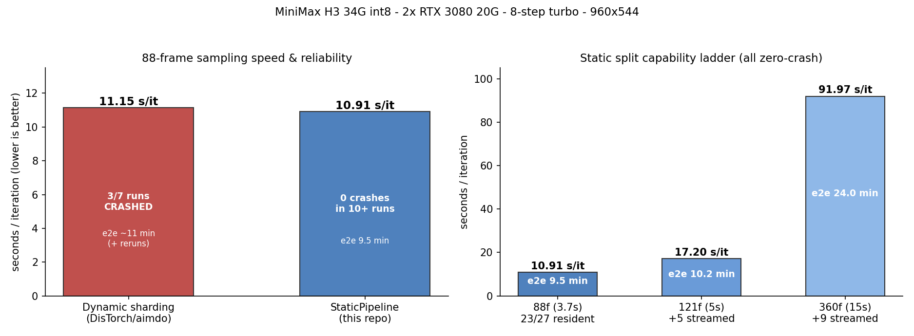

# ComfyUI-StaticPipeline（中文说明）

**[English](README.md) | 中文**

**ComfyUI 多卡静态流水线切分：DiT 块一次性放置到多张 GPU，之后权重永不移动。**

一个即插即用的自定义节点，把大型 DiT **静态切分**到多张卡上——加载时放好，推理期间权重零移动。包含长序列混合驻留（驻留块 + CPU 流式块）、量化模型的激活空间 LoRA、长视频分块计算。

在 **MiniMax H3 视频 DiT（34 GB int8_convrot）× 2 张 RTX 3080 20G** 上实战验证，最长单段 15 秒视频**零崩溃**。

---

## 问题：动态层搬运为什么不稳

社区主流方案（[ComfyUI-MultiGPU](https://github.com/pollockjj/ComfyUI-MultiGPU) 的 DisTorch）按需在设备间流式搬运权重块。在新版 ComfyUI 内核（DynamicVRAM/aimdo 虚拟显存）**叠加打包量化权重**（int8_convrot 等）的栈上，这从根本上不稳定——我们实测复现了三条不同的确定性 `access violation` 崩溃路径：

1. **VAE 驱逐崩溃**：视频 VAE 加载 → 驱逐 DiT → `unpatch_model` 摸到悬空的量化 `qdata` → 秒崩
2. **重载崩溃**：第二个任务重新 partially_load → `patch_weight_to_device` 摸到已释放的 vbar 内存 → 崩
3. **搬块崩溃**：连全新加载都会崩——块搬运的"反量化→重量化"舞（comfy_kitchen）随机踩到坏页

动态搬运在这个栈上的战绩：**3 次成功，4 次硬崩**，每次 faulthandler 都指向同一根源：量化权重虚拟内存被搬动后留下悬空指针。压垮证据：aimdo 账本的 `vbar_free_memory` 开始返回**负数垃圾值**——内核侧账本烂了，Python 层堵不住。

## 解法：权重永不再动

**静态放置**：加载时把 50 个 transformer 块一次切好（如 23 + 27 分驻两张 20G 卡），然后把 DiT 当承重墙：

- `partially_load` → 只挂补丁/刷计数器，绝不搬权重
- `partially_unload` → 谎报已释放，任何驱逐逻辑都不会碰它
- `unpatch_model` → 禁止搬家
- `free_memory` 守卫 → 静态模型永不被驱逐
- 激活值每步只在块边界过一次 PCIe（~140 MB）



### 长序列混合驻留

权重不随时长涨，激活值线性涨。节点按帧数自动切档：

| 档位 | 帧数 | 布局 | 实测（导演台接力链 段 2+） |
|---|---|---|---|
| `short` | ≤88f | 23/27 全驻留 | 73f：**6.80 s/it**（0.093 s/it·帧，0 块流式） |
| `mid` | 110–259f | 22/23 驻留 + 5 块 CPU 流式 | 124f：**~27 s/it** · 243f：**~62 s/it** |
| `long` | ≥260f | 19/21 驻留 + 9 块 CPU 流式 | 277f：**~78** · 311f：**~93** · 362f：**~107 s/it** |

导演台接力链实测成本曲线（steps=8 + turbo，960×544，段 2+）：
124f ≈ 27 s/it · 243f ≈ 62 · 277f ≈ 78 · 311f ≈ 93 · 362f ≈ 107。段 1 有一次性的
~140–240 秒成本（Triton 编译 + LoRA 首次搬运 + 静态切分落位）。

长片有两个关键旋钮：**每卡钉住 22 个热块常驻**（其余可流式），以及模型跨 prompt 常驻
（LRU 模型缓存）——同一实例第二条起免去重载、Triton 重编译与 LoRA 首次搬运，
**同档位每条省 ~5.7 分钟**。

（CPU 流式块是无损的 int8 打包拷贝，开销 ~1 秒/步。）

### 四层分块

- MLP swiglu：16k 行分块（瞬时量 2.9 GB → ~250 MB）
- LoRA 增量：1k 行分块，**原地 `add_` 进层输出**（零整份 delta 分配）
- attention qkv/out_proj 投影：4k 行分块写入预分配缓冲
- attention 核心：**query 分块**（k,v 必须全量——这是数学，不是实现选择）

### 激活空间 LoRA（bypass 模式）

不用 `weight_function` 钩子（每层每步反量化整份权重：208 层 = +5 s/it 税），改为在激活空间应用 LoRA：`y = W·x + α·B(A·x)`。权重保持打包态、int8 快路全程保留、comfy_kitchen 重量化雷区完全绕开。基于 ComfyUI 自带的 `weight_adapter/bypass.py`，修了三处：adapter 按块所在卡放置、按激活 dtype 懒转换（盲目 fp32 预转 = 448 MB 瞬时量）、分块原地累加。

### 顺手抓到的 bug（节选）

- `adaln_t_table` **每次 forward 都被 `cast_to` 复制**——360 帧任务 9 份 × 496 MB 同时存活（4.46 GB！）。gc 张量归因抓到，实例级缓存修复。
- comfy_kitchen 的 cublas workspace 绑在 `torch.cuda.current_device()`——cuda:1 上的 kernel 拿到 cuda:0 的 workspace → `cudaErrorIllegalAddress`。每个块在自己的 `torch.cuda.device` 上下文里跑修复。
- ComfyUI-MultiGPU 的 dlpack 守卫加载 `libcudart.so`——**Windows 上必崩**。补丁改为从 torch/lib 加载 `cudart64_13.dll`。
- TE 编码留下的死块池碎片化，采样在 allocated 16.5 GB 就 OOM（天花板明明还有 3 GB）。加载完成时 `empty_cache()` 修复。
- Windows WDDM 的有效显存天花板 ~19.0 GiB（20G 卡），`PYTORCH_CUDA_ALLOC_CONF=expandable_segments:True` 必开。

---

## 安装

```
cd ComfyUI/custom_nodes
git clone https://github.com/ylzbj1-stack/ComfyUI-StaticPipeline.git
```

可选补丁（见 `patches/`，`git apply` 应用）：
- `comfy-core_minimax-model_adaln-cache-embed-free.patch`——消灭每调用 496 MB 的表复制 + 提前释放 embed 中间量（单卡也受益）
- `comfy-core_weight-adapter-bypass_inplace-support.patch`——分块 LoRA 必需的原地支持
- `multigpu_p2p-registry_windows-cudart.patch`——ComfyUI-MultiGPU 的 Windows 修复（同时装那个包才需要）

## 使用

```
UNETLoader → StaticPipelineSplit(frames=实际帧数) → ... → 采样器
```

- **`frames` 必须填【单次采样】的帧数**（多段接力链填单段最大帧数，不是整链总帧数）——它决定驻留档位（<110 全驻留 / 110–259 mid / ≥260 long）
- **异构双卡（20G + 48G、3090 + 4090 等）**：设 `primary_gb` / `secondary_gb` 为两张卡各自的权重预算（经验值：显存 − 约 4G 激活余量），切分本来就是按字节预算走的，大卡自然多分块，无需其他改动；两个都留 0 则用内置档位预算（2× 20G）。**我方尚未在异构卡上实测**（只有 2× 20G）——放置逻辑不含对称假设，试过欢迎反馈。
- 启动参数：`MGPU_CPU_THRESHOLD_PERCENT=999 PYTORCH_CUDA_ALLOC_CONF=expandable_segments:True`
- **切换帧数档位要重启实例**——放置对已加载模型是一次性的
- 视频 VAE（7.9G）放不下会走 lowvram 流式，正常现象

## 打赏

如果这套方案救了你的量化多卡栈，欢迎请作者喝杯咖啡：

**USDT (TRC20)：** `TXLHM7dayYa7qHzHXWSqfrDhwZfLRT69oT`

<p align="left"></p>

## 边界

- **段长档位（实测）**：现行 dev0 预算 + 22 个钉住热块下，链式接力的 **124 / 243 / 277 / 311 / 362 帧逐档全过**（端到端验证）。此前"单段 226f / 链上 124f 天花板"的说法来自旧 dev0 预算，**已作废**。链式一段仍比同长度单段多占 ~384 MiB——"单段探针通过"不等于链上能过。
- SageAttention 会对整条 k 做一次 **513.97 MiB 的 fp32 临时拷贝**（∝ token 数 = 帧数）——长段最大的单笔 OOM 触发点，属固有成本，与 LoRA/流式块/VAE 无关。
- 三条腾显存的路实测**全部判死**：① 卡间挪权重（流式块在自己那次 forward 期间会临时落回原卡，峰值守恒）② 音频 VAE 搬 cuda:1（aimdo 的 vbar 只登记 device 0）③ TE 搬上 GPU（CUDA context 级崩溃）。
- VAE 尽量留在 GPU：给视频 VAE 腾出 ~3 GiB，decode 从 137 秒降到 46 秒。
- Windows WDDM：20G 卡有效天花板 ~19 GiB；Linux 可能更宽（未测）
